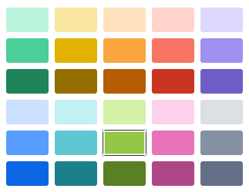
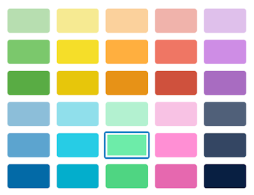

# Trello label colours

* Version 1.1.0
* Last updated: Friday 26 May 2023

## 1. Summary

Restores the classic Trello colours to those before the Atlassian update, May 2023.

### New colours

These are the new Trello label colours, of which I am not a fan.

### Classic colours

These are the classic Trello label colours, which were initially themed on the multi-coloured, striped Apple logo.

## 2. How to use

1. Install the Stylish browser extension:

* [Google Chrome](https://chrome.google.com/webstore/detail/stylish-custom-themes-for/fjnbnpbmkenffdnngjfgmeleoegfcffe)
* [Mozilla Firefox](https://addons.mozilla.org/en-GB/firefox/addon/stylish/)

2. Create a new style.
3. Copy the contents of `style.css` into the your new style.
4. Name the style something meaningful like `Trello label colours`.
5. Set URL prefix to: `https://trello.com/`.
6. Switch it on and enjoy beautiful colours once again.

---

## Changelog

1.0.0 2023-05-26 Initial version
1.1.0 2023-05-26 Move colour hex codes into variables 
                  to group them all at the top to make updating them easier