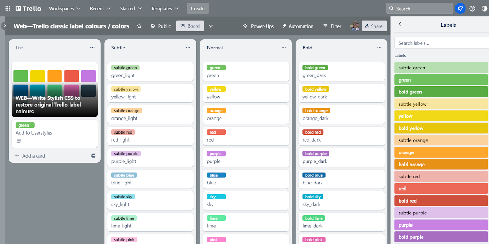

# Trello classic label colours / colors

* Version 1.3.1
* Last updated: Sunday 5 November 2023

## 1. Summary

Restores the classic [Trello](https://trello.com) label colours to those before the Atlassian update, May 2023.

_Above: Example Trello board using the restored colour palette_

### New 2023 colour pallete

These is the new 2023 Trello label colour palette:

### Classic colour palette

This is the classic (expanded) Trello label colour palette [launched in September 2022](https://blog.trello.com/20-new-trello-label-colors), which was based on the original Trello colour palette which was themed on the multi-coloured, striped Apple logo:

## 2. How to install (via Userstyles)

1. If you have not already done so, install the Stylish browser extension:

* [Google Chrome](https://chrome.google.com/webstore/detail/stylish-custom-themes-for/fjnbnpbmkenffdnngjfgmeleoegfcffe)
* [Mozilla Firefox](https://addons.mozilla.org/en-GB/firefox/addon/stylish/)

2. Visit [Trello classic label colours](https://userstyles.org/styles/265025/trello-classic-label-colours) on [userstyles.org](https://userstyles.org/styles/265025/trello-classic-label-colours).
3. Click the "Install Style" button.
4. Enjoy beautiful colours once again.

## 3. How to install (manual)

1. If you have not already done so, install the Stylish browser extension:

* [Google Chrome](https://chrome.google.com/webstore/detail/stylish-custom-themes-for/fjnbnpbmkenffdnngjfgmeleoegfcffe)
* [Mozilla Firefox](https://addons.mozilla.org/en-GB/firefox/addon/stylish/)

2. Create a new style.
3. Copy the contents of `style.css` into the your new style.
4. Name the style something meaningful like `Trello classic label colours`.
5. Set URL domain to: `trello.com`.
6. Switch it on and enjoy beautiful colours once again.

---

## Colour codes

Class names and hex codes for the classic colour palette.

### light

* green-light `#b7deb0`
* yellow-light `#f6ea92`
* orange-light `#fbd19c`
* red-light `#f0b3ab`
* purple-light `#dfc0eb`
* blue-light `#8cbed9`
* sky-light `#90dfeb`
* lime-light `#b3f1d0`
* pink-light `#f8c2e4`
* black-light `#506079`

### normal

* green `#6fc25f`
* yellow `#f2d918`
* orange `#fea72f`
* red `#ec6957`
* purple `#c883e2`
* blue `#1885c4`
* sky `#18c7e2`
* lime `#61e9a1`
* pink `#fe84cf`
* black `#486271`
* grey `#b9c3c9` (deprecated)

## dark

* green-dark `#59ac44`
* yellow-dark `#e7c60b`
* orange-dark `#e79217`
* red-dark `#cf513d`
* purple-dark `#a86cc1`
* blue-dark `#036aa7`
* sky-dark `#03aecc`
* lime-dark `#4fd582`
* pink-dark `#e668af`
* black-dark `#081f42` 

---

## Changelog

* `1.0.0 2023-05-26` 
    * ⚙ Initial version
* `1.1.0 2023-05-26`
    * ⚙ Move colour hex codes into variables to group them all at the top to make updating them easier
* `1.2.0 2023-05-27`
    * ⚙ Remove the CSS variables, in part to make the code simpler.
    * ⚙ Add @-moz domain rule to the CSS comments.
    * 🐛 Fix bug with double class-marker (full-stop) on yellow-light.
* `1.3.1 2023-11-05`
    * 🐛 Fix element. Trello changed the way labels are displayed from `button` to `span` element.
    * ⚙ Remove `div[data-color...]` selector as this is now redundant.
    * ⚙ Add `@-moz-` rule to comments as this is required to submit to Stylish.